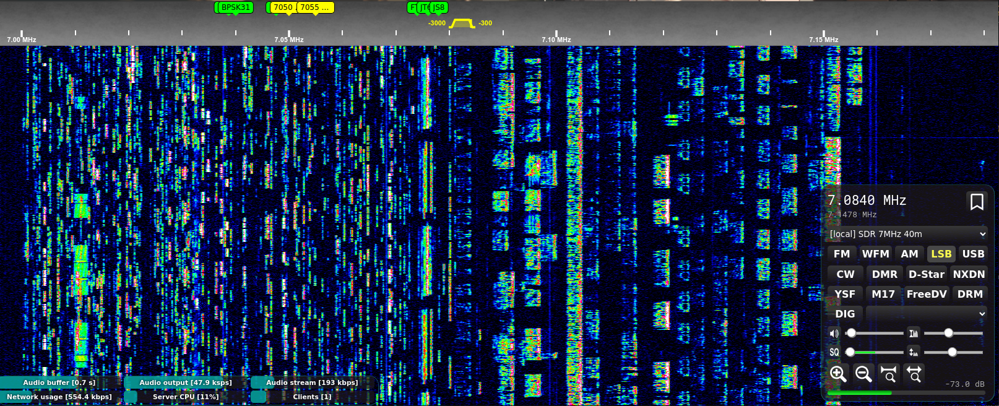
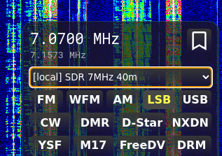

OpenWebRX
=========

OpenWebRX is a multi-user SDR receiver software with a web interface.

### Fork info:
Bugs and problems from this fork should be reported [here](https://github.com/Mr-Precise/openwebrx-glamor/issues), not to the [original](https://github.com/jketterl/openwebrx) author!  
This fork is mostly for cosmetic changes.  

Added transparency for ease of use with a small display:  

It has the following features:

- [csdr](https://github.com/jketterl/csdr) based demodulators (AM/FM/SSB/CW/BPSK31/BPSK63)
- filter passband can be set from GUI
- it extensively uses HTML5 features like WebSocket, Web Audio API, and Canvas
- it works in Google Chrome, Chromium and Mozilla Firefox
- supports a wide range of [SDR hardware](https://github.com/jketterl/openwebrx/wiki/Supported-Hardware#sdr-devices)
- Multiple SDR devices can be used simultaneously
- [digiham](https://github.com/jketterl/digiham) based demodularors (DMR, YSF, Pocsag, D-Star, NXDN)
- [wsjt-x](https://wsjt.sourceforge.io/) based demodulators (FT8, FT4, WSPR, JT65, JT9, FST4,
  FST4W)
- [direwolf](https://github.com/wb2osz/direwolf) based demodulation of APRS packets
- [JS8Call](http://js8call.com/) support
- [DRM](https://github.com/jketterl/openwebrx/wiki/DRM-demodulator-notes) support
- [FreeDV](https://github.com/jketterl/openwebrx/wiki/FreeDV-demodulator-notes) support
- M17 support based on [m17-cxx-demod](https://github.com/mobilinkd/m17-cxx-demod)

## Setup

To install the components and dependencies you can follow the [official wiki](https://github.com/jketterl/openwebrx/wiki/Setup-Guide) instructions, then you can build from this repository.

## Usage tips

You can zoom the waterfall display by the mouse wheel. You can also drag the waterfall to pan across it.

The filter envelope can be dragged at its ends and moved around to set the passband.

However, if you hold down the shift key, you can drag the center line (BFO) or the whole passband (PBS).

## Licensing

OpenWebRX is available under Affero GPL v3 license
([summary](https://tldrlegal.com/license/gnu-affero-general-public-license-v3-(agpl-3.0))).

OpenWebRX is also available under a commercial license on request. Please contact me at the address
*&lt;randras@sdr.hu&gt;* for licensing options. 
